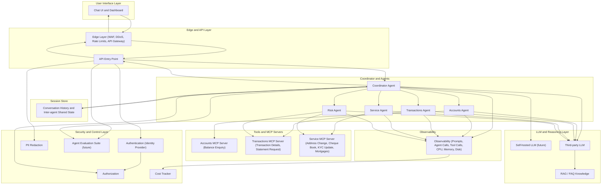

# BinaryBucks Architecture 

This document provides the complete architectural view of the BinaryBucks agentic banking support system.  
It aligns with the system architecture including:  
Edge Layer, API, Security Controls, Coordinator Agent, Domain Agents, MCP Servers, Session Store, LLM Layer, Evaluation Suite, Observability, and future components.

---

## 1. Architecture Overview

BinaryBucks follows a layered, modular architecture:

- User Interface Layer  
- Edge & API Layer  
- Security & Control Layer  
- Coordinator & Agents Layer  
- Tools & MCP Servers Layer  
- LLM & Reasoning Layer  
- Session Store Layer  
- Observability Layer  
- Future Components (Evaluation Suite, Self-hosted LLM, Mortgages, etc.)

This structure mirrors enterprise agentic patterns while remaining fully simulated.

---

## 2. Full Architecture Diagram

---

## 3. Component Summary

### User Interface Layer
- Chat UI  
- Dashboard  
- Quick actions  
- Memory display  

### Edge & API Layer
- WAF  
- DDoS protection  
- Rate limiting  
- API gateway  

### Security & Control Layer
- Authentication  
- Authorization  
- PII redaction  
- Agent evaluation suite (future)  
- Cost tracking  

### Coordinator & Agents Layer
- Coordinator agent  
- Accounts agent  
- Transactions agent  
- Service agent  
- Risk agent  

### Tools & MCP Servers Layer
- Accounts MCP  
- Transactions MCP  
- Service MCP  
- Future: mortgages, loans, onboarding  

### LLM & Reasoning Layer
- Third-party LLM  
- Self-hosted LLM (future)  
- FAQ / RAG knowledge  

### Session Store Layer
- Conversation history  
- Inter-agent shared state  

### Observability Layer
- Prompt logging  
- Agent call tracing  
- Tool call tracing  
- CPU/memory/disk metrics  
- Cost tracking  

---

## 4. Future Expansion

- Loans Agent  
- Mortgage Agent  
- Investment Agent  
- Identity/KYC Agent  
- Multi-turn workflows  
- Human review dashboards  
- Real RAG pipelines  
- Self-hosted LLM integration  

---

## 5. Disclaimer

BinaryBucks is a **simulated** system.  
It does **not** access real banking systems, real customer data, or perform real financial actions.  
All examples, profiles, and risk scores are fictional and for demonstration purposes only.

---
