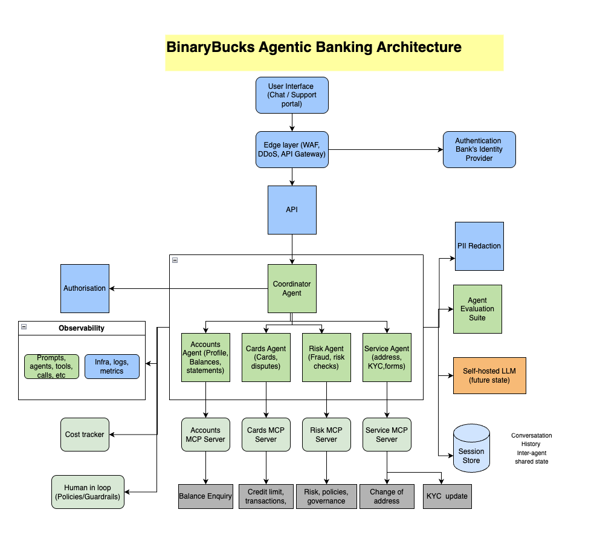

# BinaryBucks Architecture 

This document provides the complete architectural view of the BinaryBucks agentic banking support system.  
It aligns with the system architecture including:  
Edge Layer, API, Security Controls, Coordinator Agent, Domain Agents, MCP Servers, Session Store, LLM Layer, Evaluation Suite, Observability, and future components.

---

## 1. Architecture Overview

BinaryBucks follows a layered, modular architecture:

- User Interface Layer  
- Edge & API Layer  
- Security & Control Layer  
- Coordinator & Agents Layer  
- Tools & MCP Servers Layer  
- LLM & Reasoning Layer  
- Session Store Layer  
- Observability Layer  
- Future Components (Evaluation Suite, Self-hosted LLM, Mortgages, etc.)

This structure mirrors enterprise agentic patterns while remaining fully simulated.

---

## 2. Full Architecture Diagram

This GitHub-friendly preview shows the system architecture and the policy + guardrail controls that were added to the implementation.

You can also open and edit the live architecture diagram here:

- [BinaryBucks Architecture.drawio](./BinaryBucks-architecture.drawio)

This is the correct flow for a banking workflow. The user request enters the system, the orchestrator selects the relevant specialist agent, the agent performs reasoning and optionally uses LLMs or tools, and the policy/guardrail layer checks the result before any final decision or action is allowed.

---

## 3. Why the flow is structured this way

The design is intentionally agent-first and policy-controlled:

- User request enters the system through the API layer.
- The coordinator decides which domain agent should handle the request.
- Account, card, service, and risk agents perform the actual customer-facing reasoning.
- Each agent may call an LLM or tools to gather context, classify intent, or request account data.
- The results are then checked against deterministic guardrails such as refund limits, eligibility rules, fraud checks, PII controls, and compliance policies.
- If the result is valid, the action or response is allowed.
- If the result violates a policy or is ambiguous, the system escalates to human review or a safe fallback response.

This is the correct pattern for a banking environment, because the model is probabilistic and the policy layer is deterministic.

---

## 4. Deterministic Policy Examples

Examples of policy checks include:

- Refund above 500 EUR is denied automatically.
- High-risk transactions require manual review.
- PII must be redacted before logs or external calls.
- Account actions require valid customer status and eligibility checks.
- An unsupported action should not proceed unless explicitly allowed.

These policies are not separate from the agent flow; they are enforced after the agent has reasoned and before the final output or action is accepted.

---

## 5. Reliability and Deterministic Controls

To make the platform dependable in a banking environment, the architecture adds several control points:

- Policy engine with hard-coded business rules and compliance checks
- Validation before tool execution
- Retry and circuit breaker patterns for LLM and tool failures
- Fallback flows to FAQ or safe canned responses when the primary model is unavailable
- Human escalation for edge cases, fraud, or high-risk requests
- Auditable logging of prompts, tool calls, decisions, and approvals

This means the AI acts as an advisor and orchestrator, while the system enforces strict, deterministic actions where customer money or compliance is involved.

---

## 6. Component Summary

### User Interface Layer
- Chat UI  
- Dashboard  
- Quick actions  
- Memory display  

### Edge & API Layer
- WAF  
- DDoS protection  
- Rate limiting  
- API gateway  

### Security & Control Layer
- Authentication  
- Authorization  
- PII redaction  
- Agent evaluation suite (future)  
- Cost tracking  

### Coordinator & Agents Layer
- Coordinator agent  
- Accounts agent  
- Transactions agent  
- Service agent  
- Risk agent  

### Tools & MCP Servers Layer
- Accounts MCP  
- Transactions MCP  
- Service MCP  
- Future: mortgages, loans, onboarding  

### LLM & Reasoning Layer
- Third-party LLM  
- Self-hosted LLM (future)  
- FAQ / RAG knowledge  

### Session Store Layer
- Conversation history  
- Inter-agent shared state  

### Observability Layer
- Prompt logging  
- Agent call tracing  
- Tool call tracing  
- CPU/memory/disk metrics  
- Cost tracking  

---

## 7. Future Expansion

- Loans Agent  
- Mortgage Agent  
- Investment Agent  
- Identity/KYC Agent  
- Multi-turn workflows  
- Human review dashboards  
- Real RAG pipelines  
- Self-hosted LLM integration  

---

## 8. Disclaimer

BinaryBucks is a **simulated** system.  
It does **not** access real banking systems, real customer data, or perform real financial actions.  
All examples, profiles, and risk scores are fictional and for demonstration purposes only.

---
